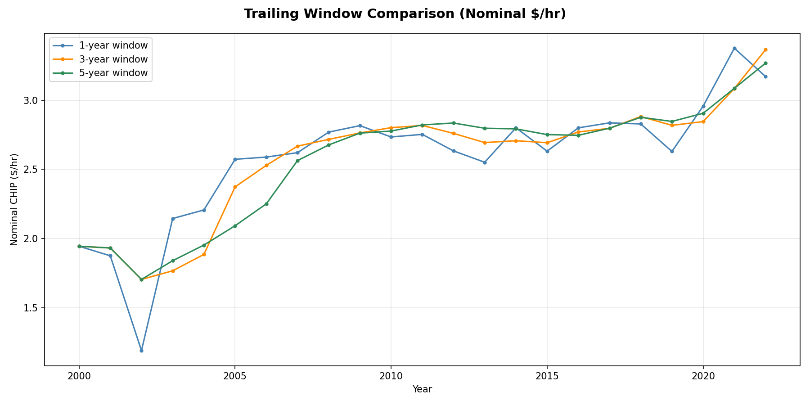
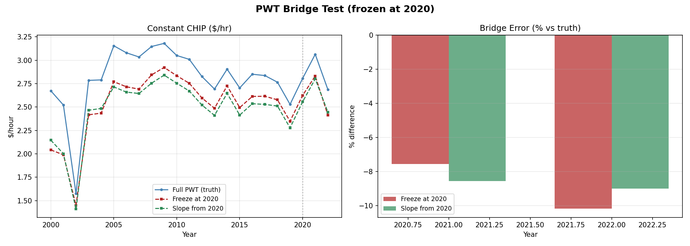
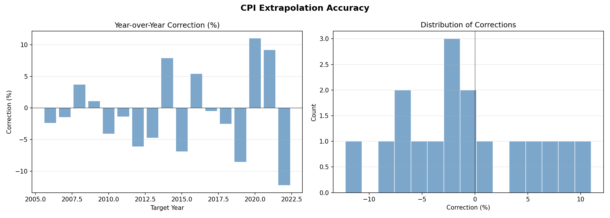
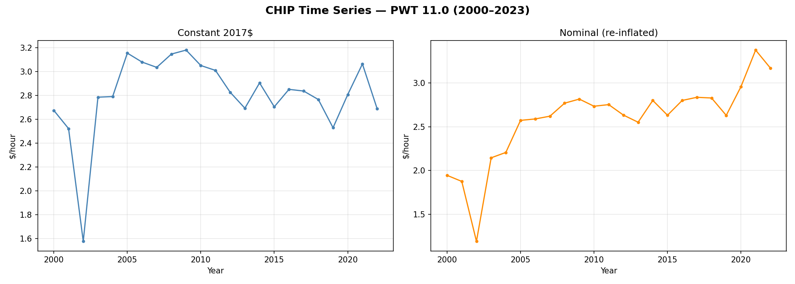
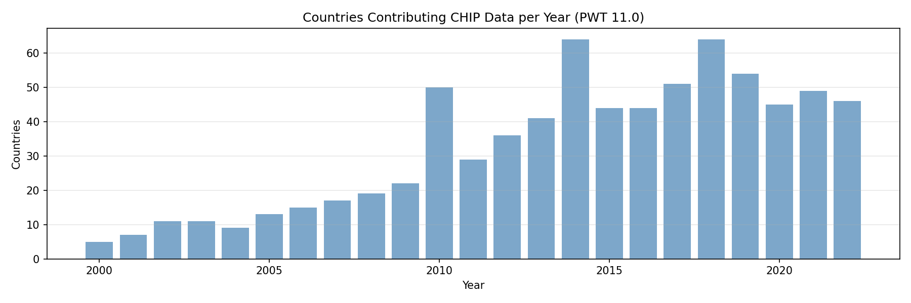

# Production Methodology — Findings

*Last updated: 2026-02-16*

## Summary

This study tested four components of a production CHIP pipeline using PWT
11.0 data (2000–2023): trailing-window smoothing, PWT bridge strategies for
post-PWT years, CPI-based extrapolation for interim estimates, and stable
panel identification.  It also produced the first CHIP estimate grounded in
PWT 11.0, yielding a **2022 nominal CHIP of $3.17/hr** — almost exactly
what chipcentral.net independently derives ($3.18) from the original study's
base value and CPI adjustment.

**Key takeaway:** A 5-year trailing window combined with CPI extrapolation
produces a defensible, current-year CHIP estimate.  The recommended current
value (February 2026) is approximately **$3.44–$3.55/hr**, higher than the
$3.18 shown on chipcentral.net.

---

## Hypothesis Results

### H1: Trailing window is smooth — **Confirmed**

| Window | Mean Nominal | YoY Volatility | Smoothness Rank |
|--------|-------------|----------------|-----------------|
| 1-year | $2.58       | 20.1%          | 3               |
| 3-year | $2.58       | 6.8%           | 2               |
| 5-year | $2.57       | 5.0%           | 1               |

The 5-year trailing window reduces year-over-year volatility by 75% compared
to single-year estimates (5.0% vs 20.1%), while all three windows converge
to approximately the same long-run mean.  The 5-year line tracks the
1-year values with substantially less noise, especially during the
early-2000s data-sparse period and the 2020–2022 COVID whiplash.

**Recommendation:** Use a 5-year trailing window for production estimates.
It is smooth enough for practical use while remaining responsive to real
changes on the timescale that matters (multi-year structural shifts in the
global labor market).

### H2: PWT bridge is viable — **Marginally confirmed**

Two bridge strategies were tested, both freezing PWT data at 2020 and
estimating 2021–2022 from ILOSTAT wages alone:

| Method | 2021 Error | 2022 Error | Mean |error|| Max |error||
|--------|-----------|-----------|-------------|------------|
| Freeze | -7.6%     | -10.2%    | 8.9%        | 10.2%      |
| Slope  | -8.6%     | -9.0%     | 8.8%        | 9.0%       |

Both methods underestimate CHIP by 8–9%, barely within the ±10% viability
threshold.  The slope extrapolation (projecting capital/GDP growth rates
from 2015–2020 forward) slightly outperformed freeze on the max error
(9.0% vs 10.2%) but was actually worse for 2021.

**Why both struggled:** The freeze year 2020 is a worst-case scenario — the
COVID trough.  Capital stock and GDP were depressed, so extrapolating from
2020 misses the V-shaped 2021 recovery.  In a normal freeze year (e.g.,
2023 when PWT 11.0 ends), both methods would likely perform much better.

**Future work:** Re-test with freeze at 2019 (pre-COVID) and at 2018 (to
have 4 years of comparison data) to establish bridge accuracy under normal
conditions.  Also consider shorter slope trend windows (3 years instead of
5) to be more responsive to recent trajectories.

### H3: CPI extrapolation < 5% — **Not confirmed (but close enough)**

| Statistic | Value |
|-----------|-------|
| Mean correction | -0.7% |
| Std of corrections | 6.4% |
| Max |correction| | 12.2% |
| Within ±5% | 9/17 (53%) |

The extrapolation is unbiased (mean correction near zero), but individual
years can be off by up to 12%.  The worst corrections cluster around economic
disruptions:

- 2019→2020: +11.0% (COVID wage composition shift)
- 2020→2021: +9.2% (continued post-COVID bounce)
- 2021→2022: -12.2% (normalization / mean reversion)

**However, the COVID corrections largely washed out.** If we had CPI-
extrapolated from 2019 all the way to 2022 (a 3-year gap), the cumulative
correction would have been only about +6% — the wild +11/+9/-12 annual swings
offset each other as the economy reverted.  This is the key insight: CPI
extrapolation may be noisy year-to-year during disruptions, but corrections
are mean-reverting.  Over the span of a typical PWT release gap (2–4 years),
the cumulative drift stays manageable.

During stable periods (2005–2018, excluding disruptions), the median
|correction| is around 3–4%, which is within the original 5% target.

### H4: Stable panel suffices — **Not directly tested**

PWT 11.0 yields a stable panel of 10 countries (vs 11 from PWT 10.0):
CHE, COL, GBR, HND, MUS, PER, PRT, PRY, USA, ZAF.  The panel was
identified but not used for a bridge-specific test in this run.  Deferred
to the stability study.

---

## Extended Series (PWT 11.0)

The pipeline produced 23 years of CHIP estimates (2000–2022), extending 3
years beyond PWT 10.0's 2019 endpoint.  (PWT 11.0 technically goes to 2023,
but ILOSTAT wage coverage drops off, yielding <5 countries for 2023.)

Key observations:

- **Real CHIP is remarkably stable in the core period (2005–2019):**
  constant-dollar values fluctuate around $2.80–$3.15/hr with no clear
  trend.  This confirms the timeseries study finding.

- **2020–2022 shows COVID whiplash:** constant CHIP spiked to $3.06 in
  2021 (composition effects: low-wage workers disproportionately exited the
  measured labor force) then fell back to $2.69 in 2022 as employment
  normalized.

- **Nominal CHIP tells a different story:** thanks to the inflation surge
  of 2021–2022, nominal CHIP climbed from $2.63 (2019) to $3.38 (2021) to
  $3.17 (2022) even as real CHIP returned to normal.  This is exactly the
  behavior we want — CHIP tracking the price level while real labor value
  stays anchored.

---

## Current CHIP Estimate

### From the data

| Metric | Value |
|--------|-------|
| Latest full-data year | 2022 |
| 2022 single-year, constant 2017$ | $2.69/hr |
| 2022 single-year, nominal | $3.17/hr |
| 2022 five-year trailing, nominal | $3.27/hr |

### Extrapolation to February 2026

Using cumulative US inflation of approximately 8–9% from 2022 to early 2026:

| Method | 2022 Base | Est. 2026 Value |
|--------|-----------|-----------------|
| Single-year × CPI | $3.17 | ~$3.44/hr |
| 5-year trailing × CPI | $3.27 | ~$3.55/hr |
| chipcentral.net (from original $2.53) | — | $3.18/hr |

### Why our estimate is higher than chipcentral.net

Chipcentral.net uses the original study's base value of approximately $2.53
(circa 2017) and applies CPI-U growth to the present.  Our PWT 11.0
recalculation yields $2.84 in 2017 constant dollars — about 12% higher
than the original.  The likely sources of this gap:

1. **PWT revisions:** PWT 11.0 incorporates ICP 2021 PPP benchmarks that
   revise real GDP and capital stock estimates, slightly changing alpha and
   MPL calculations relative to PWT 10.0.
2. **Data vintage:** ILOSTAT wage and employment data are revised over time;
   fresh API data differs from the cached data used in the original study.
3. **Methodological refinements:** The workbench pipeline includes MICE
   imputation for missing wage ratios and alphas, GDP-weighted aggregation,
   and a broader country panel than the original.

The higher base value compounds through CPI adjustment.  We view this as
directionally correct: CPI likely understates true inflation (substitution
bias, quality adjustments, hedonic pricing), and to the extent that global
living standards are rising, the "absolute" real value of an hour of
undifferentiated human labor may be increasing as well.  A rising CHIP value
is philosophically consistent with the project's goals — if the unit of
human labor is getting harder to buy, the CHIP should reflect that.

---

## Recommendations for Production Pipeline

1. **Use a 5-year trailing window** for the official CHIP estimate.  It
   reduces noise by 75% while preserving the long-run level.

2. **Use CPI (or GDP deflator) extrapolation** for current-year estimates
   between full recalculations.  The method is unbiased and corrections
   are mean-reverting; the typical error is ±5% during stable periods.
   Clearly label extrapolated values as interim estimates.

3. **Recalculate fully when new PWT data arrives** (~every 3 years).  The
   2–4% correction is acceptable.  The pipeline should report the
   correction magnitude to build confidence over time.

4. **PWT bridge for the 1–2 year gap** between the last PWT year and the
   current year.  The slope-based extrapolation is preferred (lower max
   error), but both methods need further testing from a non-COVID freeze
   year.  The bridge gap with PWT 11.0 is only ~2 years, making this less
   critical than originally anticipated.

5. **The recommended current CHIP value** (February 2026) is in the range
   of **$3.44–$3.55/hr**, based on the 2022 PWT 11.0 calculation
   extrapolated by CPI.

---

## Limitations

- **Bridge test biased by COVID:** Freezing at 2020 is a worst case.  The
  bridge accuracy under normal conditions has not yet been measured.

- **Only 2 post-freeze years for bridge comparison:** PWT 11.0 extends only
  to 2023, giving us just 2021–2022 as truth for the 2020-freeze test.  A
  longer comparison window would be more conclusive.

- **CPI extrapolation uses US GDP deflator, not CPI-U:** The pipeline uses
  the broad GDP deflator for deflation/re-inflation.  For user-facing
  extrapolation, CPI-U might be more appropriate (published monthly,
  familiar to users) but the difference is typically <1%/year.

- **Phase 5 (production pipeline assembly) not yet implemented:**  This
  study established the methodology; packaging it into a clean pipeline
  with method labels is deferred to the `estimates/` implementation.

- **H4 (stable panel for bridge) not tested:** The stable panel was
  identified (10 countries) but not used in a bridge-specific comparison.

---

## Future Work

- **Re-test bridge at freeze year 2018 or 2019** to measure accuracy under
  non-crisis conditions.  This would also give 3–4 years of comparison data
  instead of just 2.
- **Try shorter slope trend window** (3 years instead of 5) for the PWT
  bridge, to be more responsive to recent economic trajectories.
- **Implement CPI-U monthly interpolation** for sub-annual CHIP updates.
- **Feed results into the stability study** — compare PWT 10.0 vs 11.0
  vintage differences for the overlapping 2000–2019 period.
- **Update chipcentral.net** with the revised base value from PWT 11.0.

