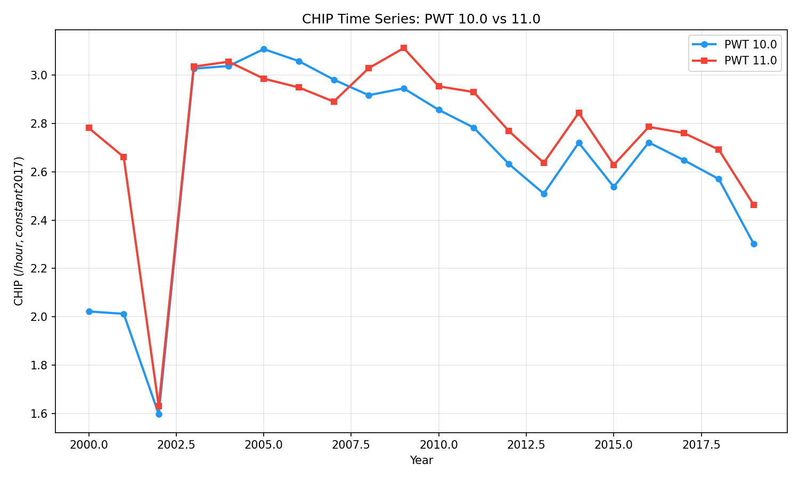
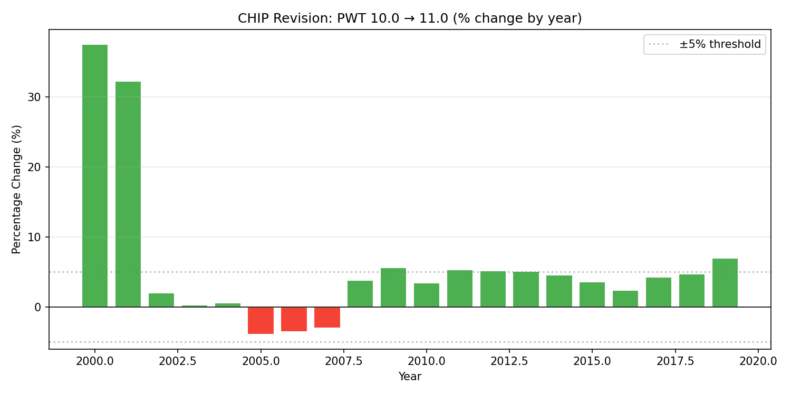
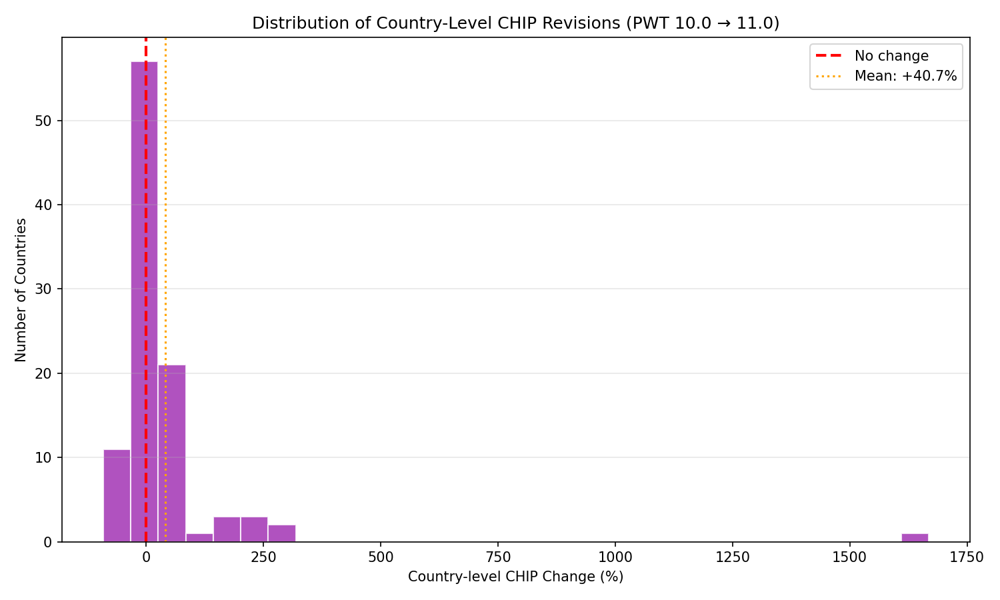
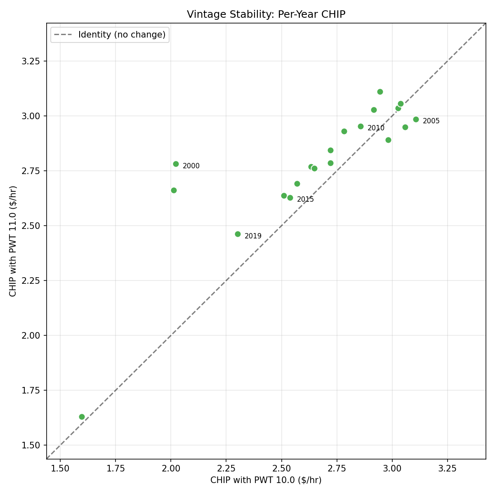

# Stability Study — Findings

## Summary

CHIP values are **not fully settled** across PWT releases. Recalculating
CHIP for 2000–2019 using PWT 11.0 instead of PWT 10.0 produces a mean
upward revision of +5.9%, with individual years ranging from +0.3% to
+37.6%. The hypothesis that revisions would be less than 5% per year and
less than 3% overall was **not confirmed**.

However, the picture improves substantially after excluding the first two
years (2000–2001), which had sparse data and were disproportionately
affected by the ICP 2021 PPP revision. For 2002–2019, the mean absolute
revision drops to 3.8% and no year exceeds 7.0%.

## Hypothesis Assessment

**H1 (Vintage stability): Individual year revisions < 5%, overall mean < 3%.**

**Not confirmed** in the strict sense:
- 7 of 20 years exceed ±5%
- Overall mean revision: 4.9% (above 3% threshold)
- Max revision: 37.6% (year 2000)

**Conditionally supported** for the mature period (2002–2019):
- Mean |revision|: 3.8%
- Max |revision|: 7.0% (year 2019)
- 13 of 18 years within ±5%

## Per-Year Revisions

| Year | CHIP 10.0 | CHIP 11.0 | Revision |
|------|-----------|-----------|----------|
| 2000 | $2.02 | $2.78 | **+37.6%** |
| 2001 | $2.01 | $2.66 | **+32.3%** |
| 2002 | $1.60 | $1.63 | +2.0% |
| 2003 | $3.03 | $3.04 | +0.3% |
| 2004 | $3.04 | $3.06 | +0.6% |
| 2005 | $3.11 | $2.99 | −3.9% |
| 2006 | $3.06 | $2.95 | −3.6% |
| 2007 | $2.98 | $2.89 | −3.1% |
| 2008 | $2.92 | $3.03 | +3.8% |
| 2009 | $2.95 | $3.11 | +5.7% |
| 2010 | $2.86 | $2.95 | +3.4% |
| 2011 | $2.78 | $2.93 | +5.3% |
| 2012 | $2.63 | $2.77 | +5.2% |
| 2013 | $2.51 | $2.64 | +5.1% |
| 2014 | $2.72 | $2.84 | +4.6% |
| 2015 | $2.54 | $2.63 | +3.6% |
| 2016 | $2.72 | $2.79 | +2.4% |
| 2017 | $2.65 | $2.76 | +4.2% |
| 2018 | $2.57 | $2.69 | +4.7% |
| 2019 | $2.30 | $2.46 | +7.0% |

## Key Findings

### 1. PWT Revisions Are Not Negligible

The ICP 2021 PPP revision (incorporated into PWT 11.0) systematically
pushed CHIP values upward, with a mean revision of +5.9%. This is larger
than the CPI extrapolation corrections measured in the production study
(std ~6.4%). A new PWT release is, in effect, a data shock comparable to
a year's worth of CPI drift.

### 2. Early Years Are Fragile

2000 and 2001 show revisions of +37.6% and +32.3% respectively. These
years have fewer countries with complete data, and the PPP revision
amplified existing instability. By 2002, the data matures and revisions
drop below 5% for most years. This reinforces the production study's
recommendation to use a 5-year trailing window anchored to the most
recent years, rather than relying on distant historical values.

### 3. The Direction Is Consistently Upward

18 of 20 years were revised upward. This suggests the ICP 2021 PPP
revision systematically lowered estimated prices in developing countries
(making their wages worth more in PPP terms), which pushed the global
GDP-weighted CHIP higher. This is a one-time adjustment — the next PWT
release (12.0) may or may not have a similar directional bias.

### 4. Country-Level Revisions Are Large and Heterogeneous

Individual countries show much larger revisions than the GDP-weighted
global aggregate:

- Mean country-level revision: +40.7%
- Std: 179.9%
- Extreme cases: Senegal +1668%, Egypt −92%

The GDP-weighted aggregate buffers these extremes (small countries with
wild revisions contribute little to the global number), but the
country-level multipliers published by the weighting study should be
treated as approximate — they may shift meaningfully when PWT 12.0
arrives.

### 5. The Scatter Is Tight for Most Years

Despite the headline numbers, the scatter plot shows that most years
cluster close to the identity line. The two outlier years (2000, 2001)
pull the statistics. For the core period (2005–2019), the correlation
between PWT 10.0 and 11.0 CHIP values is very high.

## Implications for the Production Pipeline

1. **Use the latest PWT always.** Since revisions are upward-biased and
   represent improved PPP benchmarks, there is no reason to freeze on an
   older PWT version. Each new release improves accuracy.

2. **Expect ~5% revisions when PWT updates.** The two-tier update model
   (inflation-tracking.md §7.3) should anticipate a snap of this magnitude
   when a new PWT release triggers a full recalculation. This is larger
   than the CPI extrapolation corrections but still within the range
   discussed in §7.4 (market dynamics around recalculations).

3. **Anchor to recent years.** The 5-year trailing window starting from
   the most recent data year naturally gives more weight to better-measured
   years, reducing exposure to fragile early-period values.

4. **Country multipliers should carry a version label.** Since individual
   countries can shift by 50%+ across PWT releases, published multipliers
   should clearly state which PWT version was used.

5. **Republication may be needed.** Unlike CPI extrapolation corrections
   (which are expected and small), a PWT revision changes the base value
   itself. If the correction exceeds ~5%, it may be worth republishing
   historical values rather than letting them stand.

## Limitations

- Only two PWT versions compared (10.0 → 11.0). We cannot distinguish
  the effect of the ICP 2021 PPP revision from other data improvements.
- Both runs use the same ILOSTAT wage data; only the PWT side changes.
- Early-year instability may partly reflect ILOSTAT coverage changes,
  not just PWT revisions.

## Data

- PWT 10.0: 1950–2019, 183 countries (99 in CHIP pipeline)
- PWT 11.0: 1950–2023, 185 countries (99 in CHIP pipeline)
- Overlap period: 2000–2019 (20 years)
