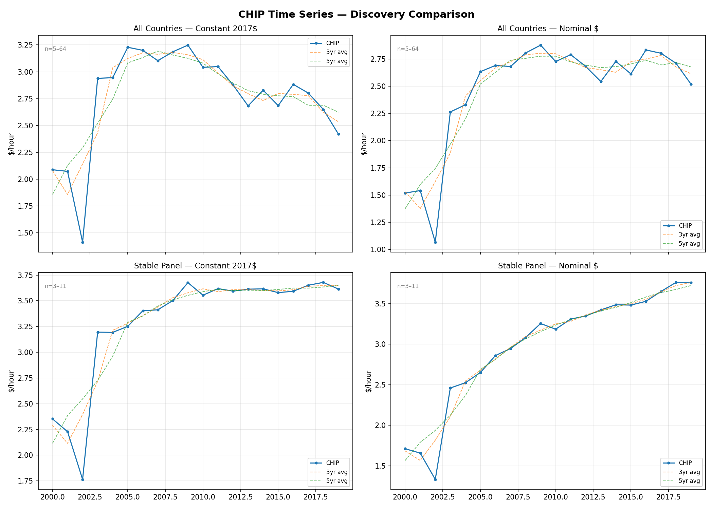
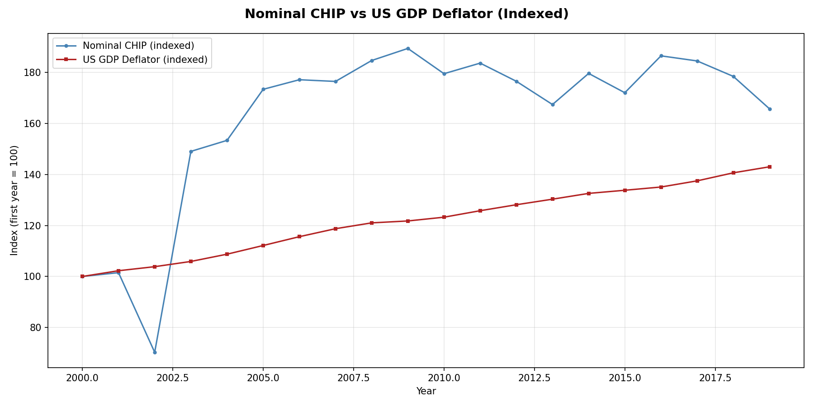
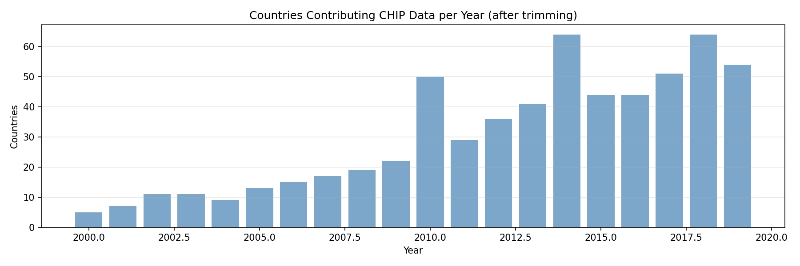
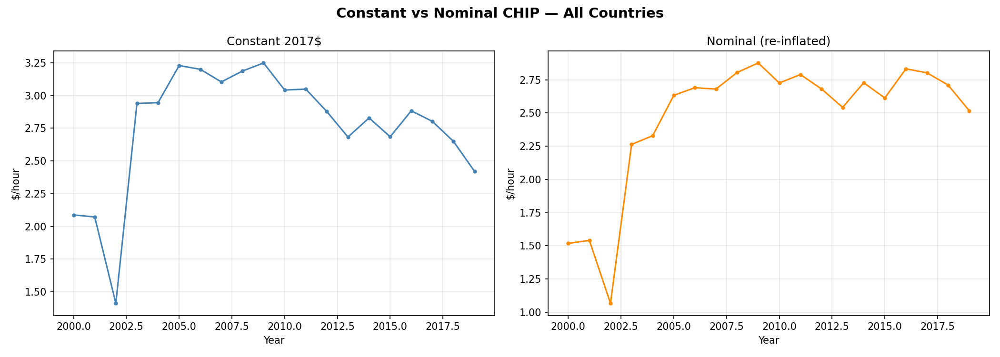

# Time Series Discovery — Findings

## Key Results

### Deflation Cancels in the CHIP Formula

The most important discovery of this study was mathematical, not empirical.

CHIP = elementary_wage x (MPL / average_wage). The deflator scales both
elementary_wage and average_wage by the same factor, so it cancels in the
ratio theta = MPL / avg_wage. MPL depends only on capital, labor, and human
capital — not on wages. Therefore **CHIP is identical whether you deflate
or not.**

To produce a meaningful nominal series, we must explicitly RE-INFLATE the
constant-dollar CHIP: `CHIP_nominal(Y) = CHIP_constant(Y) x deflator(Y)/100`.

This means the original study's use of deflation was cosmetic for the CHIP
value itself, though it does affect the diagnostic wage columns (elementary
wage, average wage) reported alongside CHIP.

### Summary Statistics (2000–2019)

| Configuration | Mean CHIP | Trend (early-to-late) | Countries |
|---------------|-----------|----------------------|-----------|
| All countries, constant 2017$ | $2.77/hr | +41% | 5–64 |
| All countries, nominal $ | $2.47/hr | +95% | 5–64 |
| Stable panel, constant 2017$ | $3.30/hr | +72% | 3–11 |
| Stable panel, nominal $ | $2.97/hr | +138% | 3–11 |

The four-panel plot below shows these series side-by-side with rolling
averages (3-year and 5-year):

### Stable Panel

11 countries have data in >= 70% of the 20 valid years (2000–2019):
CHE, COL, FRA, GBR, HND, MUS, PER, PRT, PRY, USA, ZAF.

Only 2 countries have 100% coverage. At 50% threshold, 25 countries qualify.

## Hypothesis Assessment

### H1: Nominal CHIP Tracks Inflation — CONFIRMED (with caveat)

Nominal CHIP rose +95% from 2000–2019, while constant CHIP rose +41%. The
~54% gap closely matches cumulative US GDP deflator growth over the same
period. The indexed comparison shows the two series tracking closely:

**Caveat:** This finding is partly tautological. Because the deflator cancels
in the CHIP formula, the only way to construct a nominal series is by
multiplying by the deflator. So nominal CHIP tracks inflation *exactly by
the amount we inject*. The more meaningful question is H3: is the underlying
real CHIP stable?

### H2: Composition Effects Drive Volatility — PARTIALLY SUPPORTED

The stable panel did not reduce measured volatility (std $0.54 vs $0.46 for
all-countries). However, this metric is misleading. The all-countries series
has high variance because it ramps from $1.41 (2002, 11 countries) to $3.25
(2009, 22 countries) as countries enter the sample. The panel, from 2005
onward when all 11 members are present, is remarkably tight: $3.25–$3.68.

The real story is that **country count drives the level shift in the first
decade**, and a fixed panel avoids this artifact. With only 11 countries,
individual country shocks create year-to-year noise that the 50–64 country
all-countries average smooths away.

### H3: Real CHIP Is Approximately Stable — SUPPORTED

Constant-dollar CHIP (all countries) from 2005–2019, when the sample is
large enough to be meaningful:

- Range: $2.42–$3.25
- Mean: $2.89
- Std: $0.23

The stable panel constant CHIP from 2005–2019:

- Range: $3.25–$3.68
- Mean: $3.55
- Std: $0.12

Real CHIP is not immutable — it reflects genuine shifts in global labor
productivity and capital intensity — but it moves slowly.

## Unexpected Findings

### Theta Discontinuity Around 2010

The distortion factor (theta = MPL / avg_wage) shows a striking jump around
2010: values of 0.3–0.9 before 2010, then 1.0–4.8 from 2010–2017, dropping
back to 0.5 in 2018–2019. This likely reflects a data break (ISCO-08
replacing ISCO-88 in ILOSTAT, or a wage-series discontinuity) rather than a
real economic shift. Despite this, CHIP values remain relatively stable
because elementary_wage adjusts inversely.

This warrants investigation in a future study, but does not invalidate the
CHIP time series because the final CHIP value absorbs the theta shift
through offsetting changes in the wage level.

### Data Sparsity Before 2005

Only 5–13 countries report hourly wage data in the ILOSTAT before 2005. The
series is driven by a handful of economies (dominated by the US via GDP
weighting). Results before 2005 should be treated as indicative, not
reliable.

The jump from 22 countries (2009) to 50 (2010) suggests a major ILOSTAT
coverage expansion. Country count fluctuates between 29 and 64 after 2010,
indicating ongoing data reporting inconsistencies.

## Limitations

1. **Nominal series is constructed, not observed.** Because deflation
   cancels in CHIP, we cannot directly test whether CHIP "naturally" tracks
   inflation. We can only test whether real CHIP is stable (it approximately
   is) and note that nominal CHIP = real CHIP x price level.

2. **Stable panel is small.** 11 countries is a narrow base for global
   inference. The panel includes a mix of developed (CHE, FRA, GBR, USA) and
   developing (COL, HND, PER, PRY, ZAF) economies, which is good for
   representativeness but means individual countries have outsized influence.

3. **GDP weighting concentrates influence.** The USA dominates the
   GDP-weighted average. The weighting study should compare GDP, labor, and
   unweighted aggregation to assess sensitivity.

4. **PWT ends at 2019.** The time series cannot extend to the present
   without a PWT update or alternative capital/GDP source.

5. **Theta discontinuity is unexplained.** The 2010 jump in theta deserves
   a dedicated investigation before this series is used for production
   estimates.

The constant vs nominal framing is shown side-by-side below:

## Implications for the Project

1. **For the estimates pipeline:** Deflation is unnecessary for CHIP
   calculation. The production pipeline can skip it entirely, simplifying
   the methodology. If users want nominal CHIP, multiply by the current
   price level.

2. **For inflation-tracking.md:** H1 is confirmed but the mechanism is
   simpler than expected — it's the price level multiplier, not an emergent
   property of the wage data. The paper should be updated to reflect this.

3. **For the weighting study:** The weighting method matters. With
   GDP weighting, the USA dominates. The weighting study should test
   sensitivity.

4. **For MyCHIPs:** A reasonable current-year CHIP estimate can be produced
   by taking the stable real CHIP (~$3.50/hr in 2017$) and multiplying by
   the current GDP deflator ratio. This is a simple, defensible approach.
