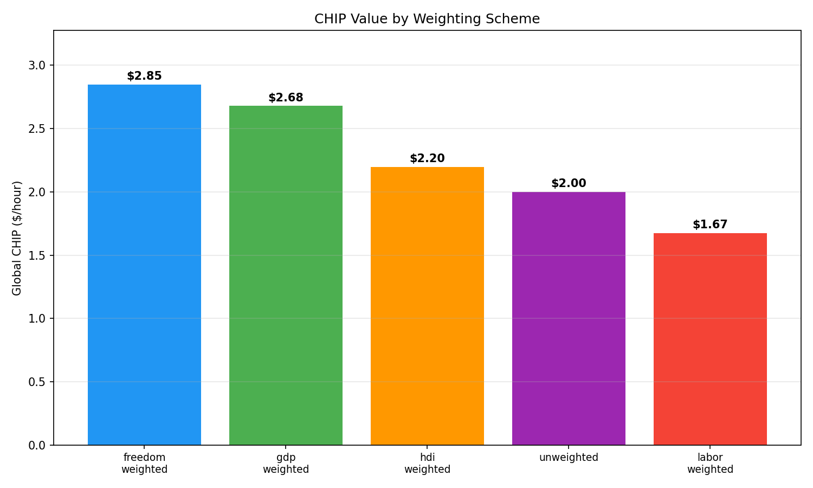
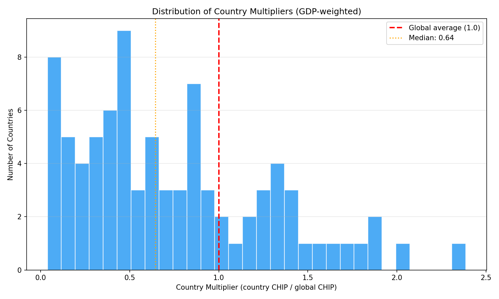
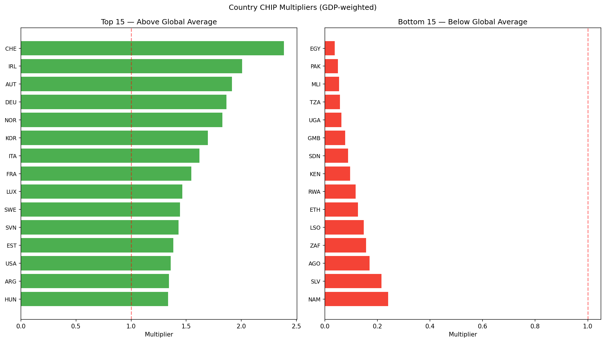
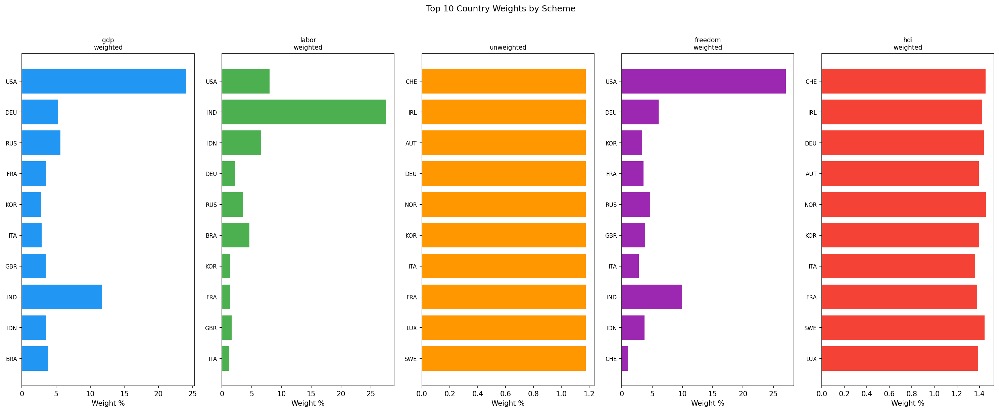

# Weighting Study — Findings

## Summary

The global CHIP estimate varies significantly with the choice of aggregation
weights — from $1.67/hr (labor-weighted) to $2.85/hr (freedom-weighted), a
spread of $1.17 (51%).  This means the weighting choice is a **first-order
methodological decision**, not a minor tuning parameter.

The five schemes tested, from highest to lowest CHIP value:

| Scheme | CHIP ($/hr) | Countries | Top Contributor | Top Weight |
|--------|------------|-----------|-----------------|------------|
| Freedom-weighted | $2.85 | 79 | USA | 27.1% |
| GDP-weighted | $2.68 | 85 | USA | 24.0% |
| HDI-weighted | $2.20 | 85 | Switzerland | 1.5% |
| Unweighted | $2.00 | 85 | (equal) | 1.2% |
| Labor-weighted | $1.67 | 85 | USA | 8.0% |

## Hypothesis Assessment

**Hypothesis: Labor-weighted CHIP is lower than GDP-weighted.**
**Confirmed.** Labor-weighted ($1.67) is 38% below GDP-weighted ($2.68).
Countries with large labor forces (India, China, Indonesia, Bangladesh)
have low unskilled wages, pulling the average down sharply.

**Hypothesis: Unweighted CHIP is lower still.**
**Confirmed.** Unweighted ($2.00) is 25% below GDP-weighted. Each country
counts equally, so the many low-wage developing countries outnumber the
few high-wage developed ones.

**Hypothesis: Freedom-weighted falls between GDP and unweighted.**
**Not confirmed.** Freedom-weighted ($2.85) is the *highest* of all five
schemes — 6% above GDP-weighted. This is because the Heritage freedom
index correlates with GDP per capita, and the GDP × freedom multiplication
amplifies the weight of wealthy, economically free countries. The USA alone
accounts for 27% of freedom-weighted CHIP vs 24% of GDP-weighted.

**Hypothesis: HDI-weighted falls near GDP-weighted.**
**Partially confirmed but lower.** HDI-weighted ($2.20) is 18% below
GDP-weighted. While HDI correlates with income, it is a 0–1 scale where
all developed countries cluster near 0.95–0.97. This compresses the
weight differential: Switzerland (HDI 0.966) gets barely more weight than
the USA (HDI 0.921), despite GDP differences of 100×. The result is
closer to an unweighted average than to GDP-weighting.

## Key Findings

### 1. Weighting Scheme Is a First-Order Choice

The coefficient of variation across the five schemes is 21%. This is not
noise — it reflects a genuine philosophical question: *whose labor defines
the global CHIP?*

- **GDP-weighting** says: the global economy as a whole, weighted by
  economic output. Rich-country wages dominate.
- **Labor-weighting** says: the average worker, regardless of which country
  they're in. Developing-world wages dominate.
- **Unweighted** says: each country's labor market counts equally.
- **Freedom-weighting** says: countries with freer markets better
  approximate the competitive equilibrium.
- **HDI-weighting** says: countries with higher living standards better
  reflect what wages would be in a well-functioning market.

### 2. The Original GDP-Weighted Approach Is Defensible

GDP-weighting ($2.68) is the second-highest result, close to freedom-
weighted ($2.85), and the original study's methodology. It produces a value
that is:
- Not dominated by any single country (USA = 24%, next is China at ~18%)
- Reasonably close to the median of all five schemes ($2.20)
- Familiar and reproducible (GDP data is the most widely available)

### 3. Country Multipliers Reveal Large Dispersion

Using the GDP-weighted global CHIP ($2.68/hr) as the reference:

- **22 countries** have multipliers above 1.0 (workers paid above global
  CHIP). These are predominantly Western European, Australasian, and
  East Asian economies.
- **63 countries** have multipliers below 1.0 (workers paid below global
  CHIP). The median multiplier is 0.64.
- **Top 5:** Switzerland (2.39×), Ireland (2.01×), Austria (1.92×),
  Germany (1.86×), Norway (1.83×)
- **Bottom 5:** Uganda (0.06×), Tanzania (0.06×), Mali (0.05×),
  Pakistan (0.05×), Egypt (0.04×)

The distribution is heavily right-skewed: most countries pay well below the
global CHIP, while a small number of wealthy nations pay significantly above
it. This is consistent with the original study's finding that global labor
markets are far from equilibrium.

### 4. HDI-Weighting Is the Most "Balanced" Alternative

HDI-weighting produces the most even distribution of weights. Because HDI
is bounded 0–1 and developed countries cluster at the top, no single
country dominates. The top contributor (Switzerland) has only 1.5% of the
weight — compared to 24–27% for USA in GDP/freedom schemes.

If the goal is to give more weight to countries "where markets work well"
without letting any one economy dominate, HDI-weighting is a strong
candidate. Its $2.20 value is lower than GDP-weighted but higher than
the simple average.

### 5. Freedom-Weighting Amplifies Rich-Country Bias

Rather than correcting for market distortions, freedom-weighting reinforces
the GDP bias. The Heritage freedom index strongly correlates with GDP per
capita, so GDP × freedom gives wealthy countries even more weight. This
makes freedom-weighting the most extreme scheme, not the most balanced.

## Recommendations

1. **Retain GDP-weighting as the primary methodology.** It is the original
   study's approach, well-understood, and reproducible. The value ($2.68)
   is defensible and not an outlier among the five schemes.

2. **Report the full five-scheme range** in published materials.
   Transparency about the sensitivity to weighting strengthens credibility.

3. **Publish country multipliers** alongside the global CHIP. These give
   users in any country an immediate sense of local labor valuation
   relative to the global norm. The multiplier table is available at
   `output/csv/country_multipliers.csv`.

4. **Consider HDI-weighting as a robustness check.** Its balanced weight
   distribution makes it a useful "second opinion" to GDP-weighting. If
   GDP-weighted and HDI-weighted values diverge sharply in a future year,
   that would signal a structural change worth investigating.

5. **Freedom-weighting is informative but not recommended as primary.**
   It amplifies the GDP bias and depends on a politically opinionated
   index. It is worth including for transparency.

## Limitations

- **85 countries** in the pipeline (of ~195 sovereign states). Missing
  countries are those without ILOSTAT wage data or PWT coverage. This
  disproportionately excludes small and conflict-affected states.
- **Heritage matching:** 79/85 countries matched (93%). Six countries
  in our pipeline lack Heritage scores — these are excluded only from
  freedom-weighting.
- **Employment data:** PWT employment (`emp`) is used for labor-weighting.
  This is total employment, not unskilled employment specifically.
- **Single time window:** Results are averaged over 2018–2022. Weighting
  sensitivity may change over time.

## Data Sources

| Source | Coverage | Status |
|--------|----------|--------|
| ILOSTAT wages/employment | 85 countries (2018–2022 window) | Complete |
| PWT 11.0 | GDP, capital, employment to 2023 | Complete |
| Heritage Foundation 2025 | 176 countries, 79 matched | Complete |
| UNDP HDI 2022 | 203 countries, 85 matched | Complete |
